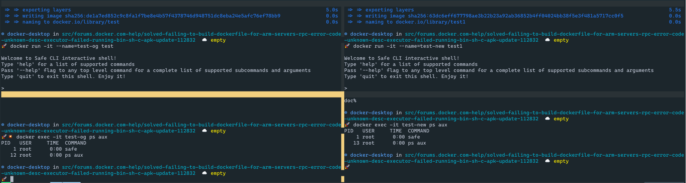

First try with your Dockerfile
```sh
docker build . -t test -f Dockerfile.og
docker run -it --name=test-og test
docker exec -it test-og ps aux
```

Second try with a slightly modified Dockerfile (removed `safe node join`)
```sh
docker build . -t test1 -f Dockerfile.new
docker run -it --name=test-new test1
docker exec -it test-new ps aux
```

Notice how there is no process running in the background for the node, as I noticed was running
after running `safe node join` in a running container.

I did realize the network joining did persist though, which is perfect, so I was wrong on that part 😄

Here is a screenshot showing how the left side (running your code) is the same as the right side
(modified Dockerfile). 


